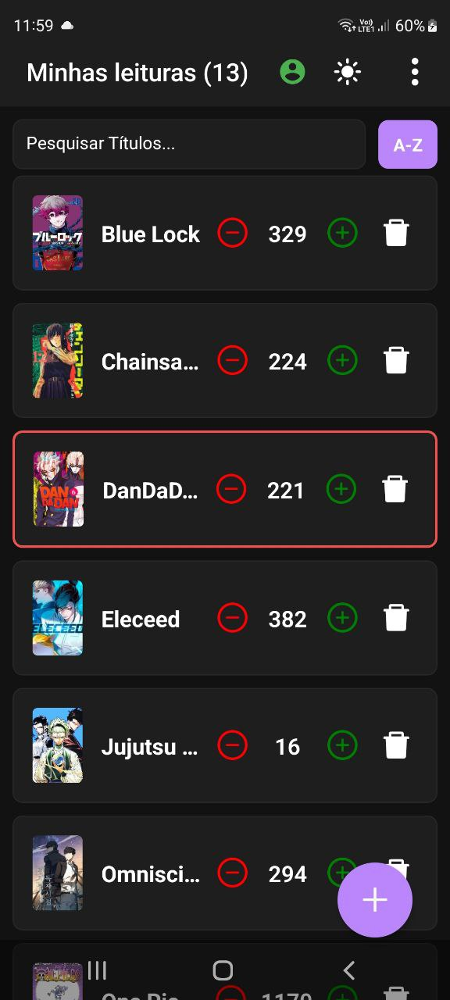
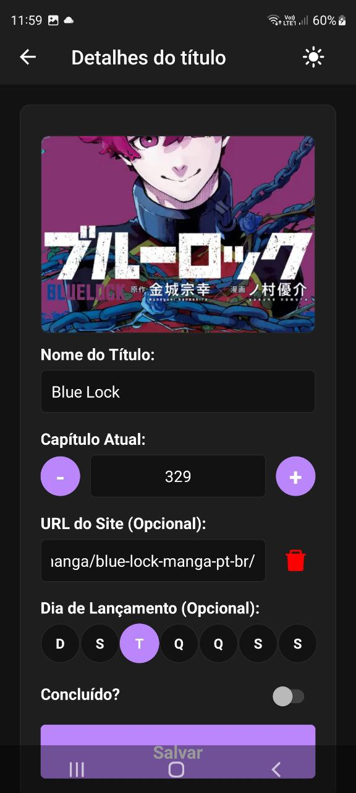
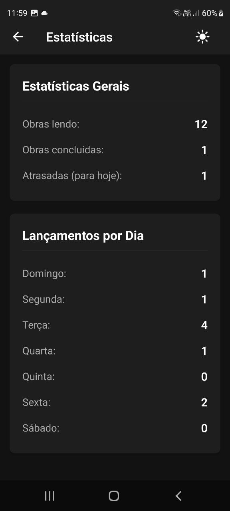
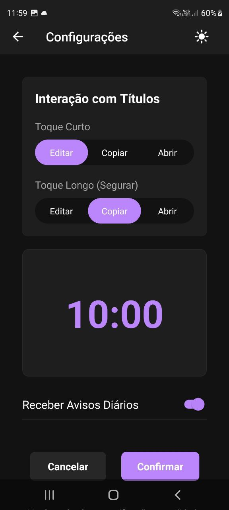
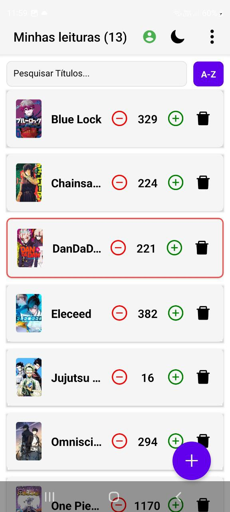

# 📚 Minhas Leituras

Aplicativo mobile desenvolvido em **React Native (Expo)** para organização e acompanhamento de leituras.  
Com ele, é possível cadastrar títulos, visualizar detalhes, acompanhar estatísticas e gerenciar preferências do usuário.

---

## ✨ Funcionalidades

- 📖 Cadastro e listagem de livros / títulos
- 🔍 Visualização de detalhes do título
- 📊 Estatísticas de leitura
- 🌗 Alternância entre tema claro e escuro
- 🔐 Autenticação de usuários
- ⚙️ Tela de configurações
- 🔔 Feedbacks visuais com Toasts

---

## 📱 Telas do aplicativo

> Prints reais do app em funcionamento

<table align="center">
  <tr>
    <th>📚 Lista de títulos</th>
    <th>📖 Detalhes do título</th>
    <th>📊 Estatísticas</th>
  </tr>
  <tr>
    <td align="center">
      
    </td>
    <td align="center">
      
    </td>
    <td align="center">
      
    </td>
  </tr>
</table>
<table align="center">
  <tr>
    <th>⚙️ Configurações</th>
    <th>🔐 Login</th>
    <th>🔆 Modo claro</th>
  </tr>
  <tr>
    <td align="center"></td>
    <td align="center"></td>
    <td align="center"></td>
  </tr>
</table>

---

## 🧭 Navegação

O app utiliza **React Navigation (Native Stack)** com as seguintes rotas principais:

- `TitleList`
- `TitleDetail`
- `Statistics`
- `Settings`
- `Login`
- `ChangePassword`

A navegação é integrada ao sistema de temas, adaptando cores dinamicamente.

---

## 🎨 Tema

O aplicativo possui suporte a **tema claro e escuro**, controlado por um `ThemeContext`, permitindo alternância em tempo real através de um botão no header.

---

## 🛠️ Tecnologias utilizadas

- **React Native**
- **Expo**
- **TypeScript**
- **React Navigation**
- **Firebase**
- **Context API**
- **Async Storage**
- **Toast Message**

---

## 📦 Dependências principais

```bash
expo
react-native
@react-navigation/native
@react-navigation/native-stack
firebase
react-native-toast-message
